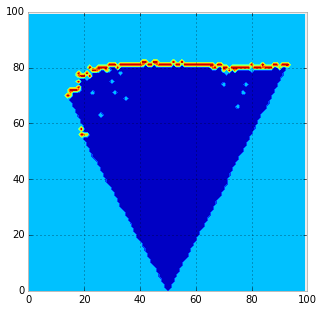

3D-OccupancyGrid-Python
=======================

An Occupancy Grid Representation in Python

Take look at the [IPython Notebook](http://nbviewer.ipython.org/github/balzer82/3D-OccupancyGrid-Python/blob/master/3D-Occupancy-Grid-ibeo-Lux.ipynb)

Integrates Range Sensor Measurements in an 3D Occupancy Grid.

to

(a 2D slice out of the 3D Occupancy Grid)

Thanks to Anton Fletcher for the [Bresenham3D Algorithm](https://gist.github.com/salmonmoose/2760072)
